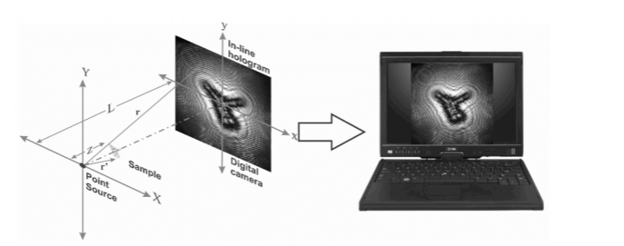
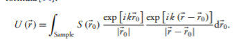
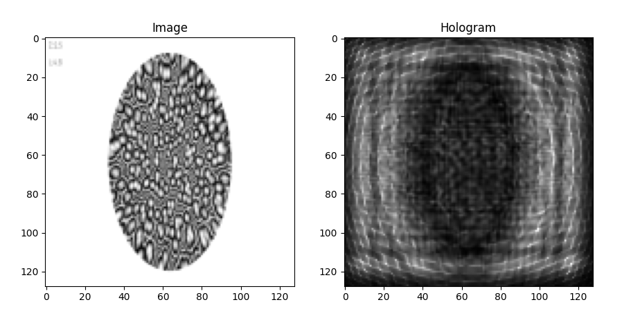
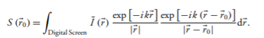
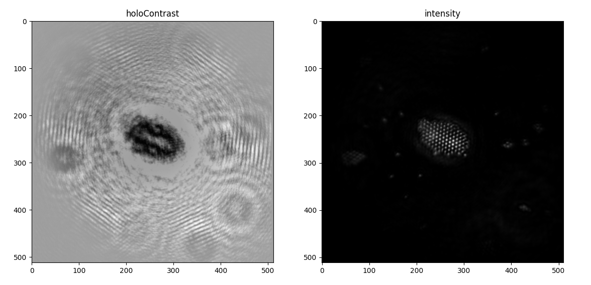

<div align="center">
    

</div>
<h1 align="center">Set of tools useful for digital lensless holographic microscopy (DLHM) using  python  </h1>

<p>
     
     Credits to: Juan Pablo Piedrahita Quintero - Jorge García Sucerquia - Carlos Trujillo
</p>

<h2>What is Digital Holography?</h2>

<p>
    Over 50 years ago, Gabor proposed a new principle of
microscopy to overcome the limitations of lenses, particularly
those of electric and magnetic lenses in electron
microscopy. In-line holography with spherical
waves, as originally proposed by Gabor, is the simplest
realization of the holographic method, working
without lenses.
</p>

<p>
Digital lensless holographic microscopy (DLHM) is perhaps
the simplest architecture of state-of-the-art of microscopy
techniques. Understood as a modern realization of Gabor’s
invention of holography  with the use of digital cameras
and computers, DLHM is also a two-stage imaging method.
A point source and digital camera are the needed hardware in
the recording stage, and a specific numerical wave propagation algorithm is necessary in the reconstruction process
</p>

<p>
The feasibility and advantages of numerical reconstruction
of digitally recorded holograms gave rise to
several new holographic techniques to study micrometer-
sized three-dimensional (3-D) phenomena. By
taking advantage of the phase information, one can
determine the contour of the nanometric structures.

</p>
<p>
 The state-of-the-art of DLHM features the said cost-effective way
of building and promises further field portability , which
will widen its spectrum of applications,such as microspheres,
 cells, plankton, and other biological specimens.
</p>


<p>
    <b>Taken from:</b></p> 
    
  <p>  https://www.osapublishing.org/ao/abstract.cfm?uri=ao-45-5-836  and  https://www.osapublishing.org/ao/abstract.cfm?uri=ao-59-19-5788 </p> 

    For more  information check the articles.


<h3>Why is it important this project?</h3>

<
<p>
     Juan Pablo Piedrahita Quintero,  Jorge García Sucerquia and Carlos Trujillo developed a  plugin ImageJ which leads a set of tools ,open source and that provide two main functionalities, Simulation and Reconstruction . This repository is an adaptation of those modules to python, taking into account that Python is one of the widely used programming languages for image processing and for sure an adaptation of that set of tools to python will bring new ideas and people to improve the software.

</p>


<h4> Simulation Module </h4>

<p>
The simulation module
is aimed to provide an easy way to produce DLHM holograms
for amplitude and/or phase objects modeled via 2D gray-level
images. that can be done using the  Rayleigh–Somerfield diffraction
formula
</p>


<div align="center">
    

</div>

<p> To simulate an image you have to use the dlhm_sim method: </p>

```
dlhm_sim(object,z,L,lambda_,dx)

    parameters:
            object:  
                Object to use as a sample 
            z:      
                 Source to sample distance
            L:
                Source to camera distance
            lambda:
                  Wavelength
            dx:
                  Hologram plane pixel pitch

    return:

        hologram:
            Hologram simulated of the object
        reference:
            Background of the system
        contrast: 
            Background subtracted with hologram

        AN:
             Numeric aperture

```


<p> You can use it for example to create a hologram from an initial object:</p>

<div align="center">
    

    
</div>

<h5> Reconstruction Module </h5>

<p>
Following the principles of holography , the information
of the sample  is reconstructed in DLHM by evaluating
the diffraction process that a converging spherical wavefront
undergoes as it illuminates the in-line hologram
 and propagates toward the sample plane

</p>

<p>
As in DLHM,
the in-line hologram or, in general, the contrast hologram is a
digital image produced in the simulation module or recorded in
a real DLHM setup. This diffraction process can be numerically
described by means of a scalar diffraction formula:

</p>

<div align="center">
    


<p>
The result  is a complex-valued quantity from
which one can compute its intensity or phase.
with Im and Re the
imaginary and real parts, respectively. The evaluation of this
diffraction process in different planes of propagation starting
from the digital camera to the point source allows the production of a stack of reconstructed images that could be utilized to
produce a 3D recreation of the sample, within the restriction of
axial resolution of DLHM
</p>

<p> To reconstruct an hologram you have to use the Reconstruct_kreuzer3F method: </p>

    ´´´
    Reconstruct_kreuzer3F(CH_m,z,L,lambda_,deltax,deltaX,FC,str)

    Parameters:

            M: CH_m

                Input hologram (hologram-reference hologram)
            z:
                Source to sample distance
            L:
                source-to-screen distance
            lambda_:
                wavelenght
            deltax:
                Pixel size for the prepared hologram
            deltaX: 
                pixel width for the reconstructed image

            FC: 
                Result of filtcosenoF function

            str:
                "save" to save image
        return: 
            K :
                Reconstructed image

    ´´´
<p> One example of the use of reconstruction module is:</p>

<div align="center">
    


<h6>Usage</h6>

<p>
In reconstruct.py and simulate.py samples you can see the respective usage for each module
</p>


<p>The required libraries are:

 cv2
 time
 math
 numpy 
 os    
 scipy
 matplotlib
 skimage  

</p>
